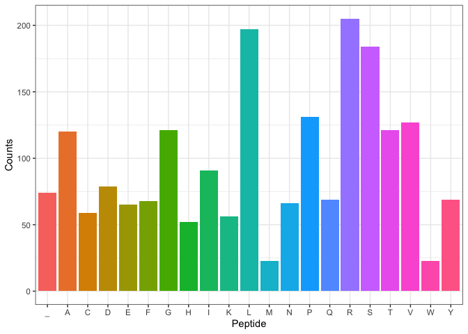

<!-- README.md is generated from README.Rmd. Please edit that file -->

# centralDogma

<!-- badges: start -->
<!-- badges: end -->

## About

The `centralDogma` package simulates the central dogma of molecular
biology: DNA -> RNA -> Peptide. The package provides functions for each
step and also a function to plot the abundance of each amino acid in a
peptide.

## Installation

``` r
devtools::install_github("rforbiodatascience22/centralDogma")
```

## Usage

``` r
library(centralDogma)
```

#### Create a random DNA strand

Normally, you have a DNA strand of your own you want to investigate, but
a random strand can be generated.

``` r
dna_strand <- random_dna(dna_length = 6000)
```

#### Transcribe DNA into RNA

The first step of the central dogma is to transcribe a gene (DNA strand)
into RNA

``` r
rna_strand <- transcribe(dna = dna_strand)
```

#### Split RNA strand into a list of codons

In reality, some post transcriptional changes occur to the messenger
RNA, but we will ignore that fact here. To properly translate the RNA,
it needs to be converted into a list of codons.

``` r
codons <- codon_split(rna = rna_strand)
```

#### Translate codons into a peptide

The list of codons can then be translated using the `codon_table`
provided with the package. Run `?codon_table` if you want more
information.

``` r
peptide <- translate(codons = codons)
```

A lot of post-translational changes are performed to the peptide, but
this package will not apply those.

You are free to explore the created peptide. Here, a function is
provided that plots the abundance of each amino acid in the peptide.

#### Plot the abundance of each amino acid in a peptide

``` r
plot_abundance(peptide = peptide) +
  ggplot2::theme(legend.position = "none")
```


